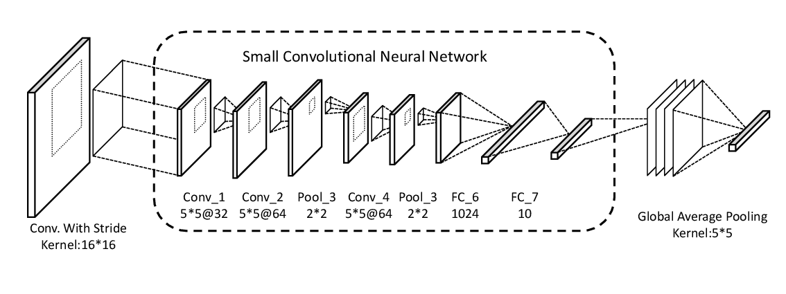

# Convolutional Neural Networks in Convolution

CNNis one of the classical architectures that reaches a decent performance on object recognition and deep CNNs have been taken as conventional architectures approaching state of art performance in object recognition tasks.
The depth of CNN, usually the numbers of convolutional layers in a network are directly related to its performance.
Because of this, increasingly more works have been taken out working on methods of approaching deeper network. 

While much research has been conducted to boost the depth of the network meanwhile, the resistance encountered when creating a deeper network, including exploding or vanishing gradient problem, intensives. The conventional solution using Deep Residual Structure addressing the fore-mentioned problems, actually breaks a deep network into the addition of multiple shallower substitutes. We thus predict that a wider approach with CNN may as well lead to improved discriminability without burdens of deeper structures. 

Ensemble-based classifiers, the foundation of wider networks, combines an ensemble of different weighed individual sub-classifiers trained with differently manipulated data-sets to acquire a performance over any individual classifier inside the ensemble.

It has been proven that, the improved performance comes from the variety of the ensemble, which to the foundation the ambiguity between different sub-classifiers. 
Assume all sub-classifiers have the same structure, the only source of variety would be the differently manipulated input data. 
There are two main categories of ensemble learning methods: dependent methods and independent methods, and input data preprocessing method also varies among different architectures.
Certain research is performed on ways making CNN wider via using ensemble-based CNN with varied inputs pre-processed by using data augmentation inspired by micro-columns of neural in the cerebral cortex.

In this work, we adopt both the advantages of ensemble-based classifiers and pre-processing method of convolution with stride inspired by NIN.
The novel elements in our model include feeding different part of the data to the classifiers using convolution with stride while all classifiers share the same set of weight and the output of each sub-classifier is then counterpoised to be assembled.
The weight-sharing and non-recurrent structure  makes the architecture have less weights and better parallelizing ability.
Our brand new way of ensemble, which contains much less weights and smaller classifiers, has higher speed meanwhile state of art performance.
What's more, our work also proved that for a fix number of parameters, wider architectures, comparing to those that are deeper, are also suitable for improving the performance in object recognition tasks and based on our experiments, combining wider architecture with deeper ones may be a futurous for further research.
